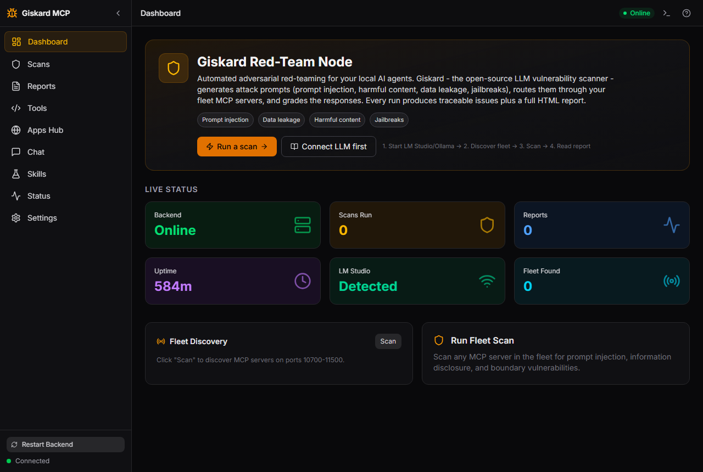
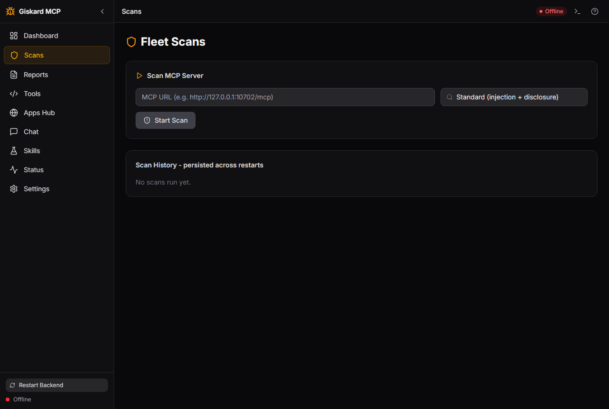

# Giskard Red-Team Node (`giskard-mcp`)

Automated adversarial red-teaming for your local AI agents. Point it at a
running MCP server and it fires prompt-injection, jailbreak, data-leakage and
harmful-content attacks at it, grades the responses with an LLM judge, and
keeps traceable issues plus a full HTML report per scan.

Built on [Giskard](https://github.com/Giskard-AI/giskard) (open-source LLM
vulnerability scanner). See [docs/ONBOARDING.md](docs/ONBOARDING.md) first if
you've never set up a local LLM.

## Preview

| Dashboard | Scans |
|-----------|-------|
|  |  |
*Live status, LLM detection, fleet discovery and scan entry — dark Vite + Tailwind webapp on :11057.*

## What You Can Do

- **Scan any running MCP server** — fleet siblings, your own dev server, anything
  speaking Streamable HTTP (`/mcp`) or legacy SSE (`/sse`). It cannot scan
  source code: run the repo first, then scan its live endpoint.
- **Scope the attack** — 7 profiles (injection, disclosure, harmful content,
  hallucination, bias, boundary, role-play) or the full detector suite.
- **Any LLM judge** — LM Studio / Ollama auto-detected, or OpenAI, Anthropic,
  Azure OpenAI with a key. Keys stay server-side.
- **Background jobs** — scans take minutes; start one, poll, cancel if needed.
- **Evidence depot** — scan history + HTML reports persist across restarts,
  compare two reports to prove a fix, chat with any configured LLM about results.

## Quick Install

```powershell
git clone https://github.com/sandraschi/giskard-mcp.git
cd giskard-mcp
uv sync
$env:MCP_TRANSPORT = 'http'
uv run python -m giskard_mcp.server   # backend :11056
```

Then open the webapp (`start.ps1`, frontend :11057) or add it to Claude
Desktop. Full paths: [INSTALL.md](INSTALL.md).

## Example Prompts

> "Scan `http://127.0.0.1:10702/mcp` for prompt injection only and tell me
> how many issues you found."

> "I cloned `some-mcp` from GitHub and it's running on port 10801. Run the
> full suite against `http://127.0.0.1:10801/mcp` with the description
> 'calendar API with delete rights'."

> "Compare the last two reports for `127.0.0.1_10702_mcp` — did my input
> validation fix actually remove the injection issues?"

How scanning a repo works (local checkout or GitHub clone): start the repo
so its MCP endpoint is live, then scan that URL. Walkthrough in
[docs/TOOLS.md](docs/TOOLS.md#scanning-a-repo-local-or-github).

## Documentation

| Doc | Contents |
|-----|----------|
| [Installation](INSTALL.md) | All install methods, prerequisites |
| [Onboarding](docs/ONBOARDING.md) | LLM setup (LM Studio / Ollama / cloud keys) |
| [Architecture](docs/ARCHITECTURE.md) | Transports, jobs, depot, ports |
| [Configuration](docs/CONFIGURATION.md) | Env vars, config options |
| [Tool Reference](docs/TOOLS.md) | All 6 MCP tools + REST + repo-scan walkthrough |
| [Development](docs/DEVELOPMENT.md) | Contributing, local setup |
| [Troubleshooting](docs/TROUBLESHOOTING.md) | Common issues |

## Requirements

- Windows 10/11 (or Docker), Python 3.12, an LLM: LM Studio or Ollama
  locally (free), or an OpenAI / Anthropic / Azure key.
- A running MCP server to scan — this tool finds vulnerabilities in live
  servers, it doesn't audit source code.

## Ports

Backend **11056**, frontend **11057** (see `fleet-start.config.ps1`).

## License

MIT
